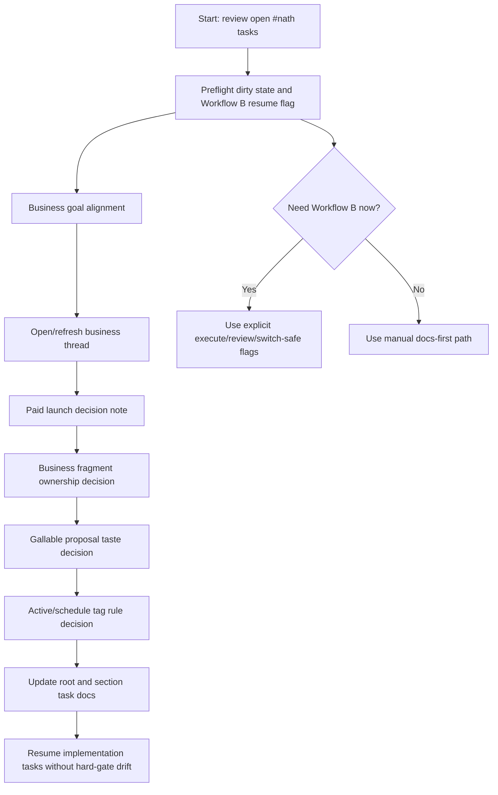
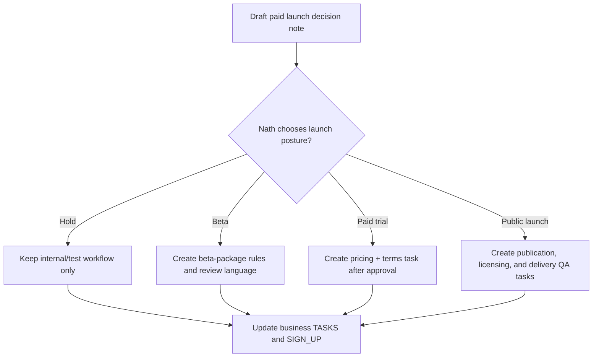
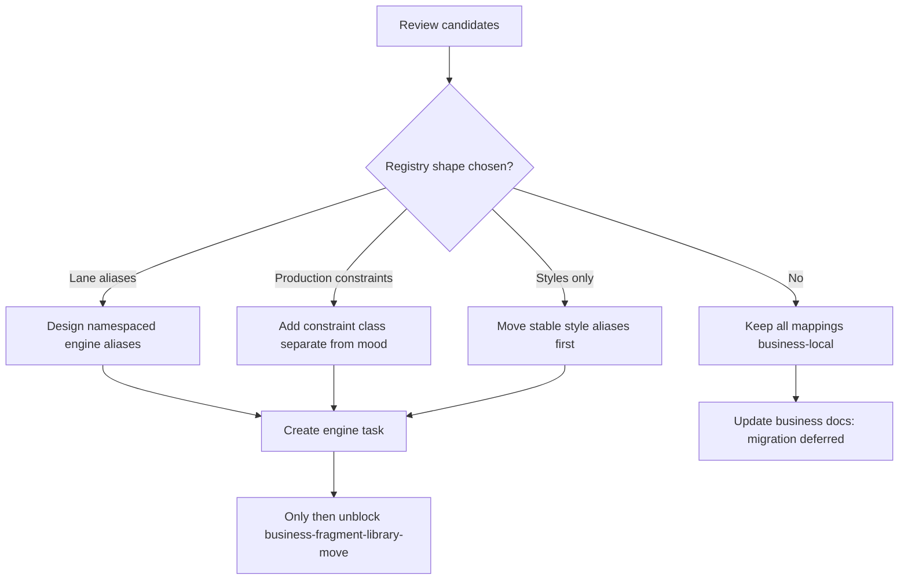
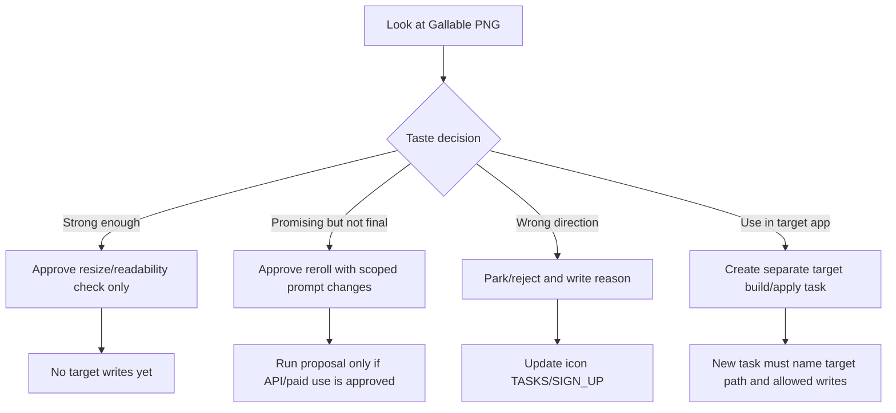
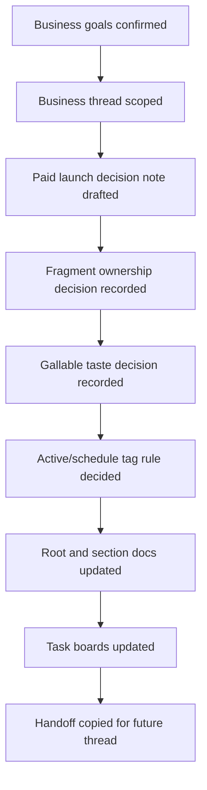

# Nath Task Step Guide - 10-05-26

Reviewed from `F:\vaultforge` on 2026-05-10.

This guide covers the open tasks tagged `#nath`, plus the blockers that should be cleared before or while completing them. It does not mark the source tasks done. Use it as the operator route for deciding, unblocking, and then handing implementation back to Codex/Workflow B.

## Open `#nath` Tasks Found

| Order | Task id / source | Task | Current blocker | Decision needed |
|---:|---|---|---|---|
| 1 | `NATHS NOTES/notes & tracking.md` | Set out tasks that reflect `vaultforge-business` goals | Old note still points at "prioritize business"; current business docs now exist | Confirm the current business goal list and convert it into task-board entries |
| 2 | `NATHS NOTES/notes & tracking.md` | Create new business thread and determine next milestone and steps | Needs a clear thread scope before agents continue | Pick the next business milestone and start from the business read order |
| 3 | `vaultforge-business/TASKS.md` `business-paid-launch-decision-gate` | Prepare Nath-facing pricing, licensing, publication, and paid-service launch decision note | Service catalog is complete, but no launch decision note exists yet | Choose launch posture later; first create the decision note with options and risks |
| 4 | `vaultforge-business/TASKS.md` `business-fragment-library-ownership-gate` | Decide engine/business ownership and registry shape before moving fragments | Candidate review exists; engine registry shape is undecided | Choose whether engine gets lane-aware aliases, separate constraints, or business-local mappings only |
| 5 | `vaultforge-icon/TASKS.md` `icon-gallable-proposal-selection` | Review the Gallable generated proposal image and decide reroll, resize-check, or target build/apply task | Taste/selection is intentionally parked for Nath | Pick one of: accept for size check, reroll, park, or create a later target-project apply task |
| 6 | `NATHS NOTES/notes & tracking.md` | Consider applying schedules and `#active` tags, then update root and section docs | This is a docs/process rule, not a build task | Decide whether to adopt the tag/schedule rule now or defer it |

## Preflight Blockers To Clear First

Do this before starting another long Workflow B run.

1. Check current dirty state:

```powershell
cd F:\vaultforge
git status --short
git -C .\vaultforge-xp4l status --short
```

2. Be aware of current known dirty/workflow surfaces:

- Root currently shows `.workflow-b.lock` deleted, modified `CHANGELOG.md`, modified `WORKFLOW_REVIEW.md`, modified `vaultforge-business/SIGN_UP.md`, nested dirty `vaultforge-xp4l`, and untracked `NATH_START.md`.
- Recursive status scans may warn about permission-denied temp folders. Treat those as existing Windows permission state unless a task specifically targets them.

3. Fix or work around `root-workflow-b-resume-execute-flag`:

- If running manually, add the missing flags yourself:

```powershell
.\run_workflow_b_watch.bat --execute --commit-mode review --hard-gate-mode switch-safe
```

- If using Workflow B heavily, fix root task `root-workflow-b-resume-execute-flag` before relying on generated resume commands.

4. Keep hard gates hard:

- Do not approve pricing, publication, licensing, paid/API use, live generation, asset move/delete, target-project writes, folder-icon application, or engine registry migration unless the matching Nath decision is explicit.

## Overall Route



## Step 1 - Convert Business Priority Into Current Tasks

Source task:

- `NATHS NOTES/notes & tracking.md`: "Set out tasks that reflect -business goals" `#nath #active #business`

Read first:

```powershell
Get-Content .\vaultforge-business\NATH_START.md
Get-Content .\vaultforge-business\BUSINESS_CLIENT_READY_CRITERIA.md
Get-Content .\vaultforge-business\BUSINESS_SERVICE_CATALOG.md
Get-Content .\vaultforge-business\BUSINESS_OUTPUT_REVIEW_CHECKLIST.md
Get-Content .\vaultforge-business\TASKS.md
```

Decision path:

1. Confirm the business lane is the current priority.
2. Use the working definition: client brief -> intake note -> prompt pack -> review -> curated selections -> package -> archived prompts/manifests.
3. Treat these as the current business goal stack:
   - create the Nath-facing paid launch decision note
   - decide fragment ownership before engine migration
   - keep real client delivery manual/reviewed until packages prove stable
4. Add or revise tasks only after deciding whether these should replace the old "business goals" note.

Exit check:

- You can point to a small set of current business tasks in `vaultforge-business/TASKS.md`.
- No pricing, licensing, publication, or live generation has been approved by accident.

## Step 2 - Start Or Refresh The Business Thread

Source task:

- `NATHS NOTES/notes & tracking.md`: "create new business thread and determine next milestone and the steps to get there" `#business #thread #planning #active #nath`

Recommended thread goal:

```text
Prepare Nath-facing paid launch and ownership decision surfaces for VaultForge Business without approving pricing, licensing, publication, live generation, paid/API use, asset moves, or engine registry changes.
```

Business thread read order:

```mermaid
flowchart LR
    R1[root CODEX_START.md] --> R2[root CURRENT_STATE.md]
    R2 --> R3[root THREAD_MAP.md]
    R3 --> B1[business CODEX_START.md]
    B1 --> B2[business README.md]
    B2 --> B3[business SYSTEM.md]
    B3 --> B4[business PLAN.md]
    B4 --> B5[business TASKS.md]
    B5 --> B6[business CHANGELOG.md]
    B6 --> B7[business SIGN_UP.md]
    B7 --> B8[client-ready criteria]
    B8 --> B9[prompt-bank README]
```



Manual command path:

```powershell
cd F:\vaultforge\vaultforge-business
Get-Content .\NATH_START.md
Get-Content .\TASKS.md
```

Workflow B path, only after preflight:

```powershell
cd F:\vaultforge
.\run_workflow_b_watch.bat --cycles 1 --timebox-minutes 20 --usage-budget-usd 1.00 --estimated-agent-usd 0.08 --hard-gate-mode switch-safe --lane vaultforge-business --execute --bypass-sandbox --commit-mode review --task "Prepare Nath-facing business decision notes only. Do not approve pricing, licensing, publication, live generation, paid/API use, asset moves, fragment migration, or engine registry ownership."
```

Exit check:

- `vaultforge-business/SIGN_UP.md` has the current thread/handoff.
- The next milestone is named and scoped.
- The thread does not silently become an implementation approval.

## Step 3 - Prepare The Paid Launch Decision Note

Task id:

- `business-paid-launch-decision-gate`

Already unblocked by:

- `business-service-catalog` is complete.
- `BUSINESS_CLIENT_READY_CRITERIA.md`, `BUSINESS_SERVICE_CATALOG.md`, and `BUSINESS_OUTPUT_REVIEW_CHECKLIST.md` exist.

Create a decision note, not a sales launch.

Suggested file:

```text
vaultforge-business/PAID_LAUNCH_DECISION_NOTE.md
```

The note should include:

1. Current service shape: logo, brand mark, app/community icon, social cover/tile, brand board, small starter pack.
2. What is ready now: intake template, prompt bank, wrappers, review summary, contact sheets, gallery, delivery skeleton, service catalog.
3. What is not ready: legal/license wording, public pricing, trademark claims, fully automated delivery, broad print-production promises.
4. Pricing options as options only:
   - free/internal beta
   - low-cost trial pack
   - fixed small starter pack
   - hold paid launch
5. Licensing/publication questions for Nath to answer.
6. Required approval line before any public or paid use.

Decision workflow:



Exit check:

- The note exists.
- It frames choices, risks, and next tasks.
- It does not state that pricing/licensing/publication is already approved.

## Step 4 - Decide Fragment Ownership And Registry Shape

Task id:

- `business-fragment-library-ownership-gate`

Already unblocked by:

- `BUSINESS_FRAGMENT_LIBRARY_CANDIDATES.md`

Core issue:

- Business mods mix brand tone, production constraints, and delivery needs.
- The engine's current `MOOD_PROMPTS` meaning is emotional mood.
- Moving business mods directly into engine mood choices would blur shared engine semantics.

Decision options:

| Option | What it means | Best when | Risk |
|---|---|---|---|
| A. Keep mappings business-local | Business wrapper keeps translating business names to engine options | Fastest and safest | Shared reuse stays limited |
| B. Add lane-aware aliases | Engine can expose namespaced business aliases without changing core meanings | Good middle path | Needs careful registry design |
| C. Add separate production constraints | Engine distinguishes mood from constraints like `print-safe` and `small-size-readable` | Best long-term shape | More engine work |
| D. Move stable styles only | Move `vector-crisp`, `clean-corporate`, `modern-startup`, `editorial-brand`; leave mods local | Practical first migration | Still needs ownership docs |

Recommended decision:

1. Keep business wrapper mappings as the production path for now.
2. Approve engine/root design for separate fragment classes:
   - preset
   - style
   - mood
   - production constraint
   - lane alias
3. Move only stable style candidates first.
4. Keep `client-pack`, market-tone mods, and low-evidence presets business-local.

Registry route:



Exit check:

- The chosen registry shape is written down.
- `business-fragment-library-move` remains blocked until the registry decision is explicit.
- No direct move into engine `MOOD_PROMPTS` happens as part of the decision note.

## Step 5 - Review Gallable Proposal Selection

Task id:

- `icon-gallable-proposal-selection`

Review files:

```powershell
cd F:\vaultforge
Get-Content .\vaultforge-icon\generated\proposals\gallable-launcher-geometric-gallery\PROPOSAL.md
Get-Content .\vaultforge-icon\generated\proposals\gallable-launcher-geometric-gallery\RUN_LOG.md
```

Generated image:

```text
vaultforge-icon/generated/proposals/gallable-launcher-geometric-gallery/images/20260504-184422-vaultforge-icon__job-gallable-launcher-geometric-gallery__proposal-gallable-launcher__01-gallable-geometric-gallery-launcher.png
```

Known review facts:

- PNG is `1024x1024`.
- Corners are transparent.
- Center alpha is opaque.
- The mark is centered and geometric.
- It uses panels, scan path, frame, and rating star.
- It has a broad glow, so launcher-size review matters.
- It has not been selected, applied, or written into `F:\projects\gallable-html`.

Decision menu:



Exit check:

- One of the four decisions is recorded.
- If a reroll is chosen, generation/API approval is explicit.
- If target app work is chosen, it becomes a separate task with exact target path and write scope.
- No folder icon application happens inside the taste decision.

## Step 6 - Decide Schedules And `#active` Tag Rule

Source task:

- `NATHS NOTES/notes & tracking.md`: "consider applying to tasks: schedules & #active tags..." `#root #tasks #documentation #inform #active #nath`

Recommended rule:

1. Use `#active` only for tasks Nath is actively steering now, not for every open task.
2. Use schedule/due metadata only when the timing is real.
3. Keep stable task ids on anything with dependencies.
4. Update root and section docs only when the tag rule changes how agents should work.

Suggested doc updates if approved:

- Root `TASKS.md` working rules: define `#active`.
- Section `TASKS.md` working rules where needed: business and icon first.
- `THREAD_MAP.md`: mention that `#active` is an operator focus signal, not cross-lane ownership.
- `NATHS NOTES/notes & tracking.md`: mark the old consideration task complete only after docs are updated.

Exit check:

- Either the rule is adopted and documented, or the task is parked with a clear reason.
- Agents know whether `#active` changes priority or is only a Nath focus marker.

## Final Completion Checklist

Use this to close the `#nath` wave cleanly.



Checklist:

- [ ] Old business-priority note has been converted into current business tasks or closed as superseded.
- [ ] Business thread has a named next milestone and read order.
- [ ] Paid launch note exists and separates options from approvals.
- [ ] Fragment registry shape is decided before any engine migration.
- [ ] Gallable proposal has a recorded taste decision.
- [ ] `#active` and schedule usage is either documented or explicitly deferred.
- [ ] Source task boards are updated after decisions.
- [ ] Any next implementation tasks are separate from Nath decision tasks.

## Prompt-Ready Handoff

Use this in a new Codex thread if you want the next agent to continue from the guide:

```text
You are in F:\vaultforge. Read NATH_TASKS_STEP_GUIDE_10-05-26.md first, then root CODEX_START.md, CURRENT_STATE.md, THREAD_MAP.md, TASKS.md, and the relevant section docs. Work only on the next approved #nath decision surface. Do not approve pricing, licensing, publication, live generation, paid/API use, asset moves/deletes, target-project writes, folder-icon application, or engine registry migration unless Nath explicitly says so. If using Workflow B, add --execute --commit-mode review --hard-gate-mode switch-safe manually until root-workflow-b-resume-execute-flag is fixed.
```

____
# TREE
#### OVERALL


____


### workflow


____

#### workflows

```mermaid
flowchart TD
    START[Start at F vaultforge] --> READ[Read this guide plus CODEX_START CURRENT_STATE THREAD_MAP TASKS]
    READ --> PREFLIGHT[Preflight git state and known dirty surfaces]
    PREFLIGHT --> LOCK[Resolve or work around missing Workflow B execute flags]
    LOCK --> GATES[Keep Nath hard gates closed]

    GATES --> PRIORITY{Business lane is current priority?}
    PRIORITY -->|Confirm| GOALS[Convert old business priority note into current business goal stack]
    PRIORITY -->|Defer| PARK_GOALS[Park old business priority note with reason]

    GOALS --> THREAD[Open or refresh business thread]
    THREAD --> THREAD_SCOPE[Name milestone and scope thread as decision surfaces only]
    THREAD_SCOPE --> THREAD_HANDOFF[Update business SIGN_UP with thread and handoff]

    THREAD_HANDOFF --> PAID[Draft PAID_LAUNCH_DECISION_NOTE]
    PAID --> PAID_READY[Record ready surfaces: intake prompt bank wrappers review contact sheets gallery delivery skeleton service catalog]
    PAID_READY --> PAID_NOT_READY[Record not ready surfaces: legal licensing public pricing trademark claims automation print promises]
    PAID_NOT_READY --> LAUNCH_POSTURE{Nath chooses launch posture?}
    LAUNCH_POSTURE -->|Hold| HOLD[Keep internal and test workflow only]
    LAUNCH_POSTURE -->|Beta| BETA[Create beta package rules and review language]
    LAUNCH_POSTURE -->|Paid trial| TRIAL[Create pricing and terms task after approval]
    LAUNCH_POSTURE -->|Public launch| PUBLIC[Create publication licensing and delivery QA tasks after approval]
    HOLD --> PAID_DONE[Paid launch note done when options risks and approval line are explicit]
    BETA --> PAID_DONE
    TRIAL --> PAID_DONE
    PUBLIC --> PAID_DONE

    PAID_DONE --> FRAG[Decide business fragment ownership and registry shape]
    FRAG --> FRAG_REVIEW[Use BUSINESS_FRAGMENT_LIBRARY_CANDIDATES as evidence]
    FRAG_REVIEW --> FRAG_CHOICE{Registry shape chosen?}
    FRAG_CHOICE -->|Business local| LOCAL[Keep wrapper mappings as production path]
    FRAG_CHOICE -->|Lane aliases| ALIAS[Design namespaced engine aliases]
    FRAG_CHOICE -->|Production constraints| CONSTRAINT[Separate constraints from mood]
    FRAG_CHOICE -->|Styles only| STYLES[Move only stable style aliases first]
    LOCAL --> FRAG_LOCAL_DONE[Write decision and keep migration blocked]
    ALIAS --> ENGINE_TASK[Create engine design task before movement]
    CONSTRAINT --> ENGINE_TASK
    STYLES --> ENGINE_TASK
    ENGINE_TASK --> FRAG_MOVE_READY[Only then unblock business fragment library move]

    FRAG_LOCAL_DONE --> GALLABLE[Review Gallable proposal image and logs]
    FRAG_MOVE_READY --> GALLABLE
    GALLABLE --> IMAGE_FACTS[Confirm facts: 1024 square transparent corners opaque center geometric mark broad glow]
    IMAGE_FACTS --> TASTE{Nath taste decision?}
    TASTE -->|Accept| SIZE_CHECK[Approve resize and readability check only]
    TASTE -->|Reroll| REROLL[Write scoped reroll prompt changes and require API approval]
    TASTE -->|Reject or park| REJECT[Record reason in icon docs and tasks]
    TASTE -->|Apply to target| TARGET[Create separate target apply task with exact path and write scope]
    SIZE_CHECK --> ICON_DONE[Icon task done when decision is recorded without target writes]
    REROLL --> ICON_DONE
    REJECT --> ICON_DONE
    TARGET --> ICON_DONE

    ICON_DONE --> TAG_RULE[Decide schedules and active tag rule]
    TAG_RULE --> TAG_CHOICE{Adopt now?}
    TAG_CHOICE -->|Yes| DOC_TAGS[Define active as Nath focus signal and use dates only when real]
    TAG_CHOICE -->|No| DEFER_TAGS[Park rule with clear reason]
    DOC_TAGS --> ROOT_DOCS[Update root TASKS THREAD_MAP and affected section docs]
    DEFER_TAGS --> ROOT_DOCS

    ROOT_DOCS --> BOARDS[Update source task boards after decisions]
    BOARDS --> CLOSE[Close or supersede old Nath notes only after docs are updated]
    CLOSE --> DONE_CHECK{Completion checklist all true?}
    DONE_CHECK -->|No| NEXT_TASK[Create separate next implementation task with lane owner scope blockers and approval gates]
    NEXT_TASK --> BOARDS
    DONE_CHECK -->|Yes| HANDOFF[Copy prompt ready handoff for future thread]
    HANDOFF --> COMPLETE[Done: decisions recorded docs synced gates preserved implementation unblocked only where approved]

    GATES -. never without explicit Nath approval .-> BLOCKED[Blocked actions: pricing licensing publication live generation paid API use asset moves target writes folder icon application engine registry migration]
    BLOCKED -. if requested later .-> NEXT_TASK
```


