# Workflow B Current State

This file diagrams the current Workflow B controller state.

Source files represented here:

- `run_workflow_b.bat`
- `workflow_b_controller.py`
- `MULTI_AGENT_WORKFLOW.md`
- `MULTI_AGENT_WORKFLOW_B.md`
- `WORKFLOW_REVIEW.md`
- root and section routing docs

## Mermaid Graph

```mermaid
flowchart TD
    Start["Operator starts run_workflow_b.bat"] --> BatRoot["Batch resolves VaultForge root"]
    BatRoot --> BatPython{"Root venv python works?"}
    BatPython -- yes --> UseVenv["Use F:/vaultforge/.venv/Scripts/python.exe"]
    BatPython -- no --> UsePathPython["Fallback to python on PATH"]
    UseVenv --> Controller["Launch workflow_b_controller.py"]
    UsePathPython --> Controller

    subgraph Setup["Controller setup"]
        Controller --> ParseArgs["Parse args: cycles, lanes, task, execute, parallel, commit mode"]
        ParseArgs --> FindRoot["Find root by CODEX_START.md and THREAD_MAP.md"]
        FindRoot --> ValidateCycles{"cycles >= 1 and review interval valid?"}
        ValidateCycles -- no --> SetupStop["Stop with clear setup error"]
        ValidateCycles -- yes --> MakeRunId["Create timestamped run id"]
        MakeRunId --> MakeRunDir["Create run packet folder"]
        MakeRunDir --> LockCheck{".workflow-b.lock exists?"}
        LockCheck -- yes and no force --> LockStop["Stop: active or stale lock must be handled"]
        LockCheck -- yes and force --> RemoveLock["Remove stale lock"]
        LockCheck -- no --> AcquireLock["Write .workflow-b.lock with run id and pid"]
        RemoveLock --> AcquireLock
    end

    subgraph PlanBuild["Plan construction"]
        AcquireLock --> ParseAgentTasks["Parse optional agent-task overrides"]
        ParseAgentTasks --> BuildAgents["Build agent list"]
        BuildAgents --> RootCoord["root-coordinator"]
        BuildAgents --> LaneBuilders["one builder per selected lane"]
        BuildAgents --> LaneReviewers["one reviewer per selected lane"]
        BuildAgents --> RootRecorder["root-recorder"]
        RootCoord --> RunPlan["Assemble RunPlan dataclass"]
        LaneBuilders --> RunPlan
        LaneReviewers --> RunPlan
        RootRecorder --> RunPlan
        RunPlan --> WatchList["Build workflow watch list"]
        WatchList --> WatchRootDocs["MULTI_AGENT_WORKFLOW.md, MULTI_AGENT_WORKFLOW_B.md, WORKFLOW_REVIEW.md, THREAD_MAP.md, TASKS.md"]
        WatchList --> WatchExternal["F:/toakezg/workflows/workflow-types.md if present"]
        WatchList --> WatchExtra["plus any --watch-workflow-file paths"]
        WatchRootDocs --> Fingerprint0["Hash watched workflow files"]
        WatchExternal --> Fingerprint0
        WatchExtra --> Fingerprint0
        Fingerprint0 --> RootDocs0["Read root doc snapshots"]
        RootDocs0 --> WritePlan["Write workflow-b-plan.json and workflow-b-plan.md"]
        WritePlan --> StatusPlan["Append plan_created to status.jsonl"]
    end

    StatusPlan --> CycleStart

    subgraph CycleLoop["For each cycle from 1 to --cycles"]
        CycleStart["Start cycle"] --> MakeCycleDir["Create cycle-XX and outputs folder"]
        MakeCycleDir --> StatusCycleStart["Append cycle_started"]
        StatusCycleStart --> WatchEnabled{"--watch-workflows enabled?"}

        WatchEnabled -- no --> NoWatchNote["Write no-watch workflow-update-note.md"]
        WatchEnabled -- yes --> FingerprintN["Hash watched workflow files again"]
        FingerprintN --> ChangedDocs{"Any watched workflow file changed since last snapshot?"}
        ChangedDocs -- yes --> StatusChanged["Append workflow_docs_changed with changed file list"]
        ChangedDocs -- yes --> RefreshWorkflowState["Update workflow fingerprint baseline"]
        ChangedDocs -- no --> NoChangeNote["No workflow document changes detected"]
        StatusChanged --> WorkflowChangeNote["Write cycle workflow-update-note.md with changed files"]
        RefreshWorkflowState --> RefreshRootDocsA["Refresh root doc snapshots"]
        NoChangeNote --> RefreshRootDocsA
        NoWatchNote --> RefreshRootDocsA

        RefreshRootDocsA --> ReviewDue{"Review snapshot due? cycle 1, every N cycles, or changed docs"}
        ReviewDue -- yes --> UpdateReview["Update WORKFLOW_REVIEW.md controller snapshot"]
        UpdateReview --> StatusReview["Append workflow_review_updated"]
        StatusReview --> RefreshRootDocsB["Refresh root docs after review update"]
        RefreshRootDocsB --> RefreshWorkflowState2["Refresh workflow fingerprint baseline so controller self-update is not treated as external change"]
        ReviewDue -- no --> PromptPrep["Prepare prompts"]
        RefreshWorkflowState2 --> PromptPrep

        PromptPrep --> PerAgent["For each agent in plan"]
        PerAgent --> SectionDocs{"Agent lane is root?"}
        SectionDocs -- yes --> UseRootDocs["Use root docs only"]
        SectionDocs -- no --> ReadSectionDocs["Read lane CODEX_START, SYSTEM, PLAN, TASKS, CHANGELOG, SIGN_UP"]
        UseRootDocs --> BuildPrompt["Build agent prompt"]
        ReadSectionDocs --> BuildPrompt
        BuildPrompt --> PromptContains["Prompt includes task, lane, role, write scope, workflow update note, commit policy, root docs, section docs"]
        PromptContains --> WritePrompt["Write cycle-XX/agent.prompt.md"]
        WritePrompt --> QueuePrompt["Queue prompt job"]
    end

    QueuePrompt --> ExecuteGate{"--execute set?"}
    ExecuteGate -- no --> FinishCycle["Append cycle_finished"]

    subgraph ExecuteMode["Execute mode"]
        ExecuteGate -- yes --> ParallelGate{"--parallel set?"}
        ParallelGate -- no --> Sequential["Run prompt jobs sequentially"]
        ParallelGate -- yes --> Parallel["Run same-cycle prompt jobs in parallel"]

        Sequential --> ResolveCodex["Resolve Codex CLI: codex.cmd, codex.exe, or explicit --codex-bin"]
        Parallel --> ResolveCodex
        ResolveCodex --> CodexMissing{"Codex CLI found?"}
        CodexMissing -- no --> CodexStop["Stop with Codex CLI path error"]
        CodexMissing -- yes --> BuildCmd["Build codex exec command"]

        BuildCmd --> SandboxGate{"--bypass-sandbox set?"}
        SandboxGate -- yes --> Bypass["Use --dangerously-bypass-approvals-and-sandbox"]
        SandboxGate -- no --> Sandbox["Use --sandbox read-only, workspace-write, or danger-full-access"]
        Bypass --> Stdin["Pipe prompt to codex exec via UTF-8 stdin"]
        Sandbox --> Stdin
        Stdin --> StatusAgentStart["Append agent_started"]
        StatusAgentStart --> CodexExec["Codex CLI agent runs in lane workdir"]
        CodexExec --> SaveLast["Save final agent message to outputs/agent.last-message.md"]
        SaveLast --> StatusAgentFinish["Append agent_finished with return code"]
        StatusAgentFinish --> AgentReturn{"Return code is 0?"}
        AgentReturn -- no --> ReturnFailure["Controller returns failure code and lock cleanup runs"]
        AgentReturn -- yes --> MoreAgents{"More prompt jobs this cycle?"}
        MoreAgents -- yes --> ResolveCodex
        MoreAgents -- no --> FinishCycle
    end

    subgraph AgentPromptRules["Rules inside each generated Codex agent prompt"]
        AgentPrompt["Agent prompt"] --> RoleGate{"Role"}
        RoleGate -- coordinator --> CoordinatorRules["Route by THREAD_MAP, check gates, continue or stop"]
        RoleGate -- builder --> BuilderRules["Use Planner-Executor-Verifier, make smallest scoped lane change"]
        RoleGate -- reviewer --> ReviewerRules["Use specialist review posture, verify behavior, find drift and test gaps"]
        RoleGate -- recorder --> RecorderRules["Update handoff, changelog, task notes, resume prompt"]

        AgentPrompt --> WorkflowPatterns["Workflow pattern guidance"]
        WorkflowPatterns --> RouterTriage["Router-Triage for mixed tasks"]
        WorkflowPatterns --> MemoryRefresh["Memory-Context Refresh at cycle start"]
        WorkflowPatterns --> PEV["Planner-Executor-Verifier for build lanes"]
        WorkflowPatterns --> ParallelReview["Parallel Specialist Review for risk lenses"]
        WorkflowPatterns --> BuilderCritic["Sequential Builder-Critic for docs and prompts"]
        WorkflowPatterns --> TestLoop["Test-Driven Agent Loop for code and CLI behavior"]
        WorkflowPatterns --> HumanGate["Human-In-The-Loop for hard gates"]

        AgentPrompt --> CommitMode{"Commit mode"}
        CommitMode -- never --> NoCommit["Do not commit; record changed files and suggested message"]
        CommitMode -- review --> ReviewCommit["Reviewer may commit after scoped changes pass review"]
        CommitMode -- cycle --> CycleCommit["Recorder may commit at end of cycle"]
        CommitMode -- agent --> AgentCommit["Each agent may commit its coherent scoped work"]
        ReviewCommit --> CommitSafety["Before editing: git status baseline; stage only own files; inspect git diff --cached --stat; record hash"]
        CycleCommit --> CommitSafety
        AgentCommit --> CommitSafety
    end

    subgraph Gates["Hard and soft gates"]
        GateCheck["Coordinator or agent checks gates"] --> HardGate{"Hard gate?"}
        HardGate -- yes --> DecisionNote["Write decision note: done, blocked, options, recommendation, resume command"]
        DecisionNote --> StopForNath["Stop and ask Nath"]
        HardGate -- no --> SoftGate{"Soft gate or live-required item?"}
        SoftGate -- yes --> RecordTask["Record task or handoff note and continue if safe approved slice remains"]
        SoftGate -- no --> ContinueWork["Continue current cycle or next cycle"]
    end

    FinishCycle --> StatusCycleEnd["Append cycle_finished"]
    StatusCycleEnd --> MoreCycles{"More cycles remain?"}
    MoreCycles -- yes --> CycleStart
    MoreCycles -- no --> RunFinished["Append run_finished"]
    RunFinished --> PrintPacket["Print Workflow B run packet path"]
    PrintPacket --> CleanupLock["Remove .workflow-b.lock in finally block"]
    ReturnFailure --> CleanupLock
    SetupStop --> End["End"]
    LockStop --> End
    CodexStop --> CleanupLock
    StopForNath --> CleanupLock
    CleanupLock --> End
```



## Current Behavior Summary

- Default mode is plan and packet generation only.
- `--execute` launches Codex CLI through `codex exec`.
- Prompts are piped through UTF-8 stdin so VaultForge task markers do not break
  on Windows code pages.
- `--bypass-sandbox` is available for trusted local runs when the Codex Windows
  sandbox hits `CryptUnprotectData` errors.
- Workflow documents are watched between cycles by default.
- `WORKFLOW_REVIEW.md` is updated on cycle 1, every configured review interval,
  and whenever watched workflow docs change.
- The controller refreshes workflow fingerprints after its own
  `WORKFLOW_REVIEW.md` snapshot update so controller self-updates are not
  treated as external workflow changes on the next cycle.
- Commit behavior is prompt-driven, not a controller-level blind `git add`.

## Main Files And Outputs

```text
F:\vaultforge\
  run_workflow_b.bat
  workflow_b_controller.py
  MULTI_AGENT_WORKFLOW.md
  MULTI_AGENT_WORKFLOW_B.md
  WORKFLOW_REVIEW.md
  workflow_b.md
  runs\workflow-b\<run-id>\
    workflow-b-plan.json
    workflow-b-plan.md
    status.jsonl
    cycle-01\
      workflow-update-note.md
      root-coordinator.prompt.md
      <lane>-builder.prompt.md
      <lane>-reviewer.prompt.md
      root-recorder.prompt.md
      outputs\
        <agent>.last-message.md
```
